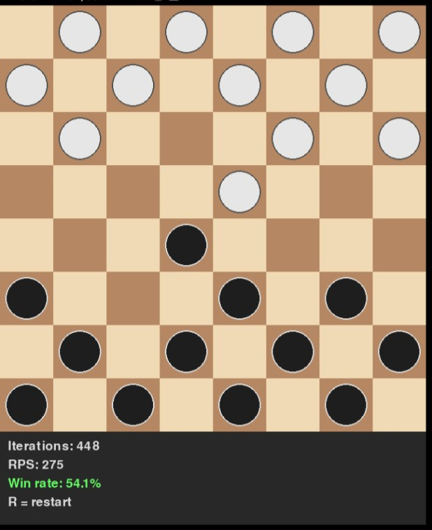
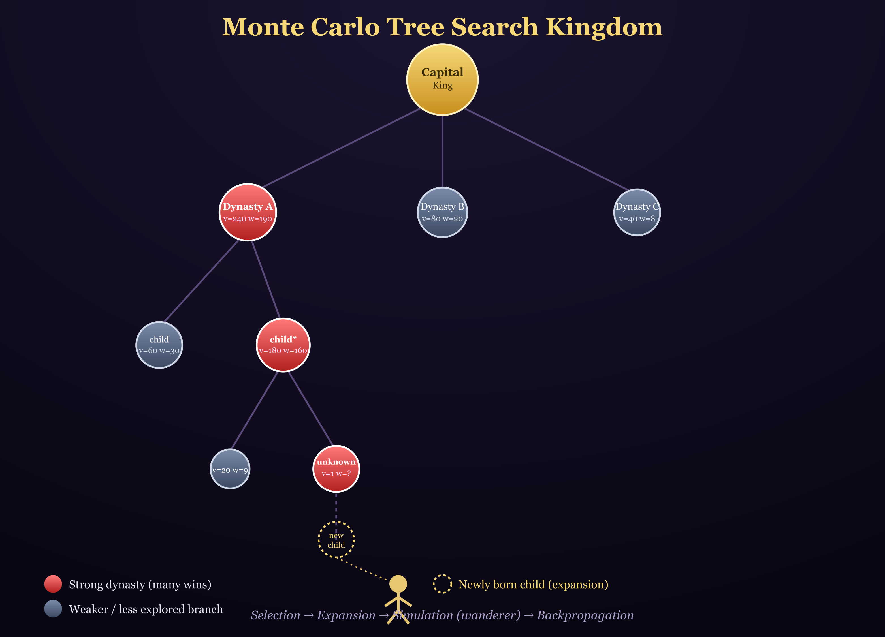

# Mcts-checkers-vs-user
Mcts based checkers engines , pygame gui .

To launch main programs run:
python3 macaron_checkers.py 
or
python3 gemini_checkers.py

To test move generation ie run perft:
python3 Kreuzer_opt.py  

Email kestutisgasaitis@gmail.com

    The Kingdom of Monte Carlo Tree Search
    Imagine every node is a small kingdom.
    Each kingdom keeps records:
    How many travelers visited it (visits)
    How much treasure it earned (wins)
    Which children kingdoms already exist (children)
    Which children are still waiting to be born (untried_moves)
    The King sits in the capital and asks:
    
    "Which of my children seems the most promising?"
    
    He chooses a child who is either very successful or still mysterious and unexplored.
    Then that child asks the same question about its own children.
    Then the grandchild.
    Then the great-grandchild.
    This continues until they reach a kingdom that still has an unborn child.
    A royal bakery opens its book of recipes and bakes a brand new child kingdom.
    Now a wild adventurer is sent into that new land.
    He has no strategy.
    He wanders wherever fate takes him, making random choices until his journey finally ends.
    When he returns, he brings news:
    "Victory!"
    "Defeat!"
    "Draw!"
    The news travels back through every kingdom he visited.
    Each kingdom updates its records and becomes a little wiser.
    The King repeats this process thousands of times:
    Follow the most promising bloodline.
    Create a new child.
    Send an adventurer.
    Learn from the result.
    Eventually, some family branches become famous for producing victories, while others earn a reputation for failure.
    At the end, the King does not simply choose the best child.
    He chooses the child belonging to the strongest dynasty.
    That child is the move selected by MCTS. 😆😆😆
    

    

Which child is the best one ?
gemini_checkers.py added.
